# 국내 주식 관심종목 앱

관심, 검색, 종목상세 화면 3개를 Flutter로 구현한 과제입니다.
요구사항은 [`docs/ASSIGNMENT.md`](docs/ASSIGNMENT.md), 데이터 연동 가이드는 [`docs/NAVER_API.md`](docs/NAVER_API.md)를 따랐습니다.

## 1. 실행 방법

| 항목 | 내용 |
| --- | --- |
| Flutter / Dart | Flutter 3.47.5 (stable), Dart 3.13.4 (`pubspec.yaml`의 SDK 제약 `^3.11.5`) |
| 확인한 기기 | Android 에뮬레이터 Pixel_8 |
| 빌드 환경 | Gradle 8.14, AGP 8.11.1, Kotlin 2.2.20 (JDK 21 사용. JDK 25는 이 Gradle 버전과 맞지 않았습니다) |
| 폰트 | 기본 제공 Noto Sans KR을 그대로 사용했습니다. (변경 없음) |

```bash
flutter pub get
flutter run          # 모바일 기기 또는 에뮬레이터에서 실행
flutter analyze      # 정적 분석 (문제 없음)
flutter test         # 전체 테스트
```

웹(Chrome)에서는 Naver endpoint가 CORS를 허용하지 않아 동작하지 않습니다.

---

## 2. 구현 범위

### 필수 항목

| 화면 | 구현한 것 |
| --- | --- |
| 관심 | 목록(종목명, 현재가, 등락), 빈 상태, 정렬 시트(가나다순, 현재가순, 등락률순), 새로고침 버튼과 당겨서 새로고침, 시세를 아직 못 받은 행의 스켈레톤 |
| 검색 | 초기 상태, 결과 없음, 로딩, 오류(다시 시도), 검색어 하이라이트, 관심 등록과 해제 토스트 |
| 종목상세 | 헤더(뒤로 가기, 종목명, `종목코드 · 시장`, 관심 별), 현재가와 등락(▲/▼), 기간 탭(1개월, 3개월, 6개월, 1년), 캔들 차트, 요약 카드(시가, 고가, 저가, 거래량, 시가총액), 일별 시세 표 |
| 공통 | 하단 탭, 관심 상태 동기화(관심, 검색, 상세 어디서 바꿔도 함께 반영), 검색 결과와 관심 목록에서 상세로 이동 |

- 남은 필수 항목: 없습니다.
- 추가로 구현한 선택 항목: 당겨서 새로고침 구현.
- 구현하지 않은 선택 항목: 일별 시세 표의 무한 스크롤, 차트 축 라벨과 거래량 바, 차트 영역 채우기, 크로스헤어/툴팁, 차트 전환 애니메이션, 관심 목록 로컬 저장

### 테스트

`flutter test` **56개 모두 통과**, `flutter analyze` 문제 없음.

| 테스트 파일 | 개수 | 확인하는 것 | 인터넷 |
| --- | --- | --- | --- |
| `test/app_flow_test.dart` | 5 | **앱 전체 흐름**: 가짜 서버로 검색 → 관심 3종목 등록 → 정렬 → 상세(기간 탭, 표) → 관심 해제와 동기화, 새로고침 실패, 차트와 표 실패 후 재시도 | 필요 없음 |
| `test/widget_test.dart` | 2 | 시작 화면(다크 테마의 빈 관심 화면), 하단 탭 전환 | 필요 없음 |
| `test/like_notifier_live_test.dart` | 15 | 관심 화면: 검색으로 3종목 등록, 묶음 조회, 정렬 3가지, 해제와 재등록, 새로고침 성공과 실패, 시세 없는 종목, dispose | 필요 |
| `test/detail_notifier_live_test.dart` | 26 | 종목 상세: 시세, 기간별 캔들, 최근 5일 표, 기간 탭 구간 재사용, 실패와 재시도, dispose | 필요 |
| `test/search_notifier_live_test.dart` | 5 | 검색 상태 전환, 빠른 연속 입력(요청 1번), 실제 타임아웃 | 필요 |
| `test/api_test.dart` | 3 | 검색, 실시간 시세, 종목 메타 endpoint 호출 | 필요 |

```bash
flutter test                         # 전체 (56개)
flutter test --exclude-tags live     # 인터넷 없이 (7개: app_flow 5 + widget 2)
flutter test --tags live             # 실서버만 (49개)
flutter test test/app_flow_test.dart # 파일 하나만
```

- `live` 테스트는 진짜 서버로 요청합니다. 시세가 실시간으로 바뀌므로 값 자체가 아니라 **정렬 순서, 요청 횟수, 형식**을 확인하도록 작성했습니다.
- 앱 전체 흐름 테스트는 진짜 서버 대신 가짜 서버가 응답하므로 인터넷 없이 같은 결과가 나옵니다. 이를 위해 `EdencrewAssignmentApp`이 `apiClient`를 선택적으로 받도록 했습니다(값을 안 주면 진짜 통신).

#### 테스트 실행 결과 화면

> 결과 화면 중간에 보이는 `시세 조회 실패: ApiException ...` 같은 로그와 스택 트레이스는 **실패 상황(타임아웃, 연결 끊김, HTTP 500)을 일부러 만들어 보는 테스트가 남기는 정상 출력**입니다. 테스트가 실패한 것이 아닙니다.
> `live was used in the suite itself` 경고는 실서버 테스트 꼬리표(`live`)를 `dart_test.yaml`에 등록하지 않아 나오는 안내이고, 실행에는 영향이 없습니다.

**1) 전체 실행 (`flutter test`)**: 마지막 장에서 `+56: All tests passed!`를 볼 수 있습니다. (한 번의 실행을 스크롤 순서대로 나눠 찍었습니다.)

<details>
<summary>전체 실행 결과 화면 7장 펼치기</summary>

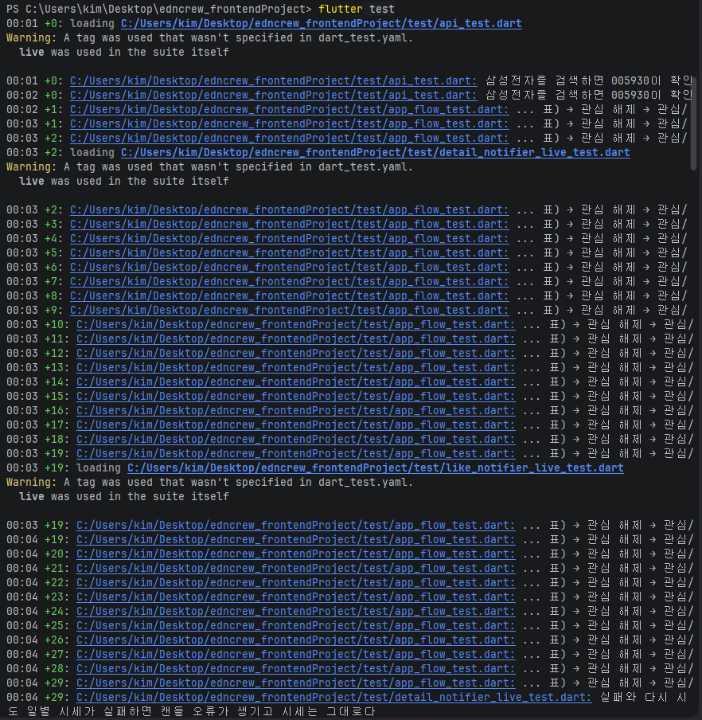

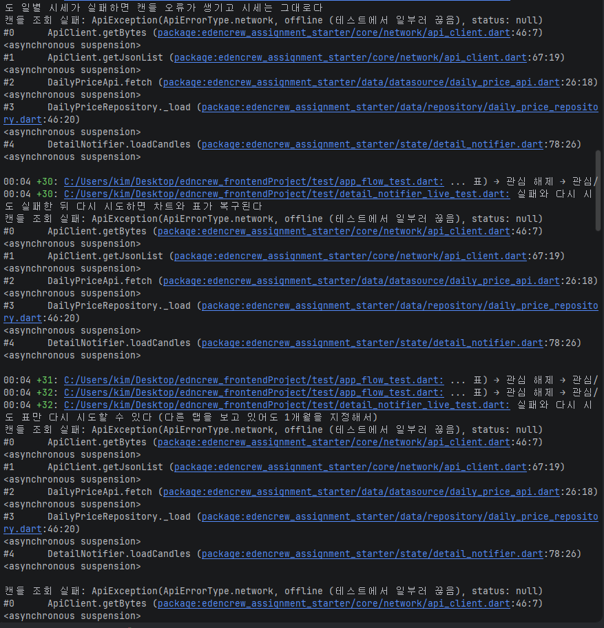

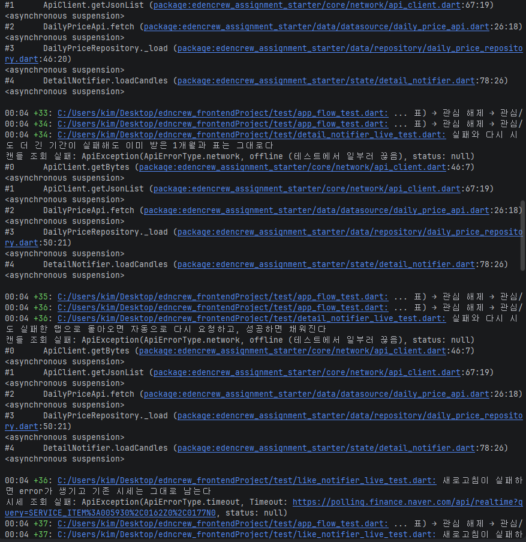

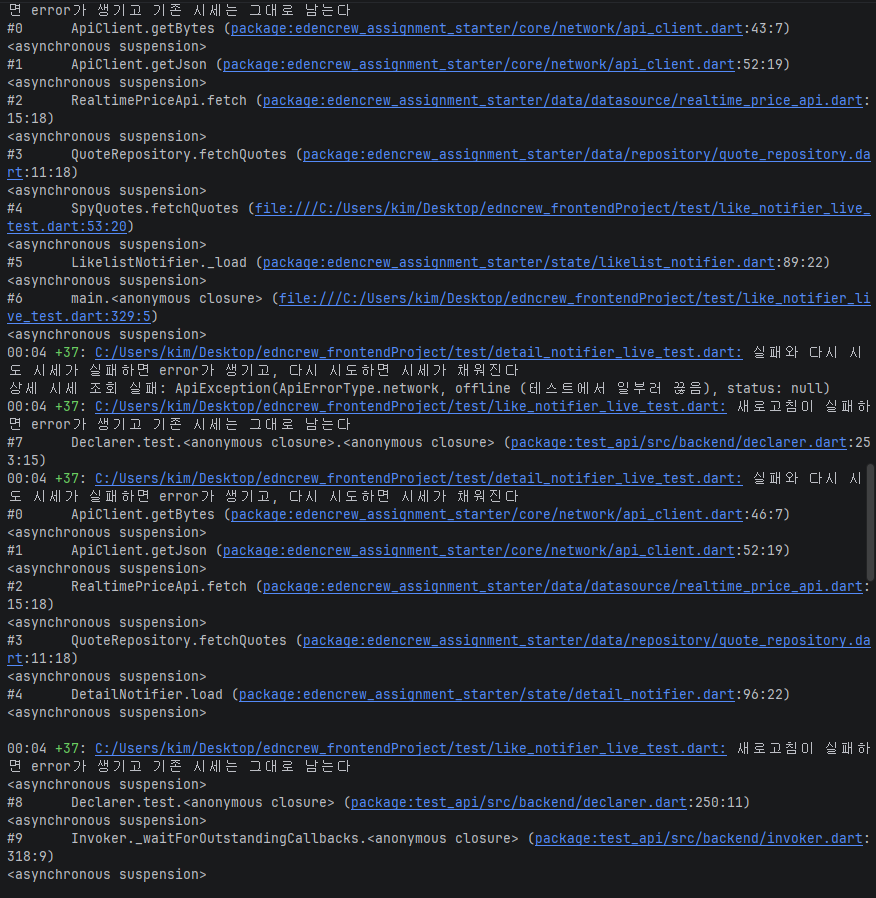

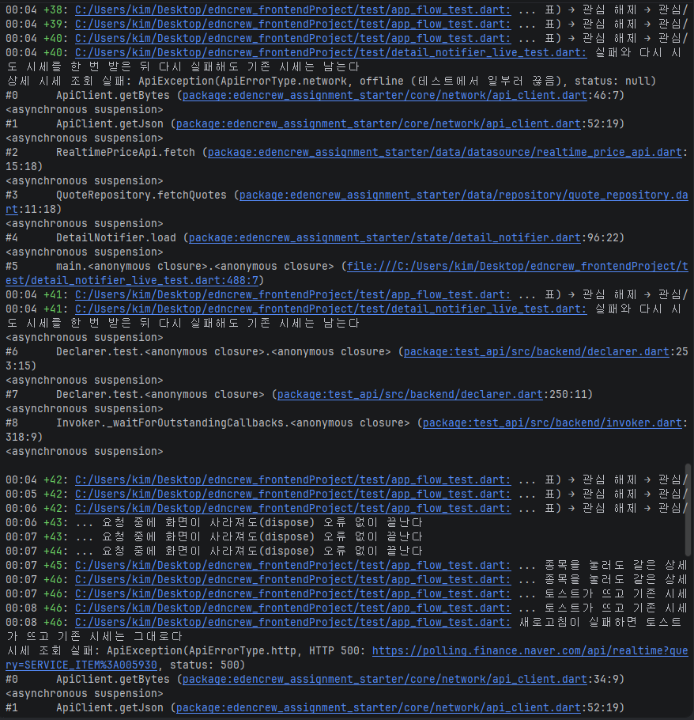

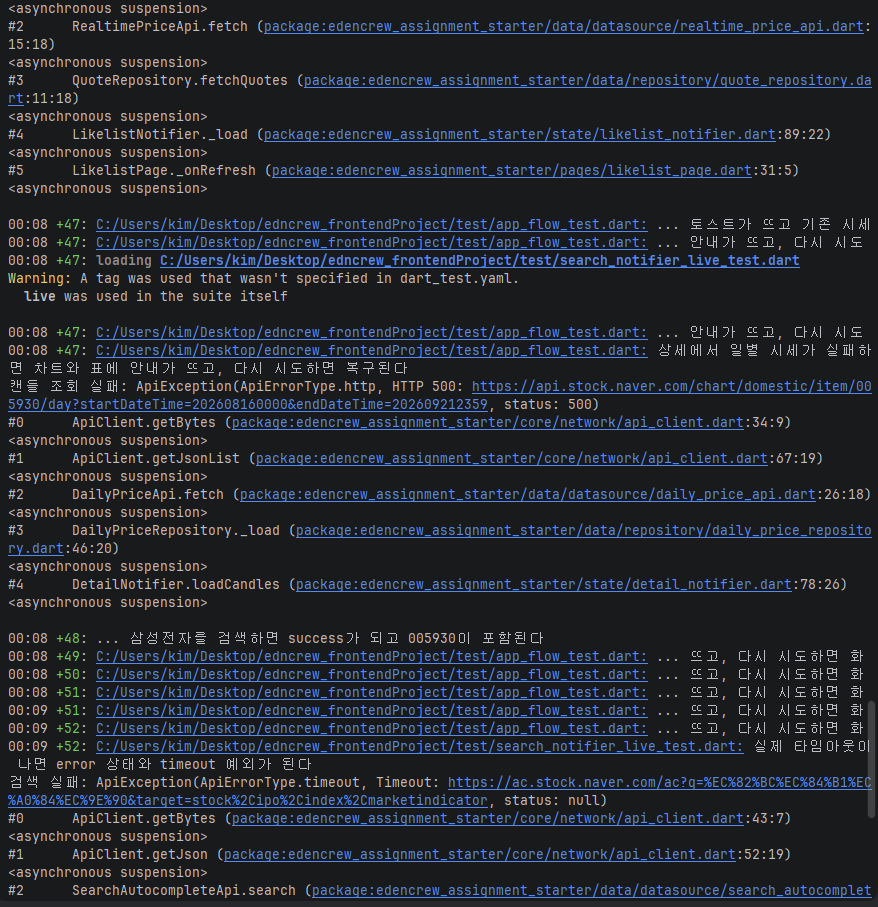

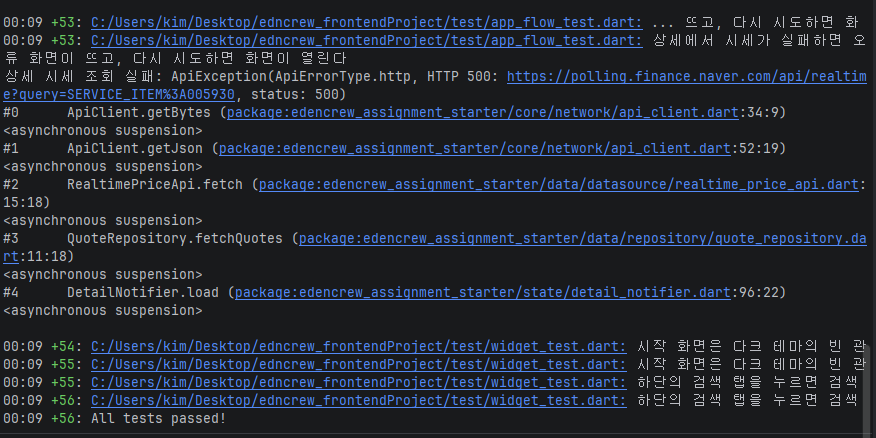

</details>

**2) 파일별 실행 (`flutter test <파일>`)**: 모두 `All tests passed!`입니다.

| 테스트 파일 | 결과 화면 |
| --- | --- |
| `test/app_flow_test.dart` (5개) | [1](docs/images/app_flow_test-1.png), [2](docs/images/app_flow_test-2.png) |
| `test/widget_test.dart` (2개) | [1](docs/images/widget_test-1.png) |
| `test/like_notifier_live_test.dart` (15개) | [1](docs/images/like_notifier_live_test-1.png), [2](docs/images/like_notifier_live_test-2.png) |
| `test/detail_notifier_live_test.dart` (26개) | [1](docs/images/detail_notifier_live_test-1.png), [2](docs/images/detail_notifier_live_test-2.png) |
| `test/search_notifier_live_test.dart` (5개) | [1](docs/images/search_notifier_live_test-1.png) |
| `test/api_test.dart` (3개) | [1](docs/images/api_test-1.png) |

<details>
<summary>파일별 결과 화면 펼치기</summary>

**app_flow_test.dart**

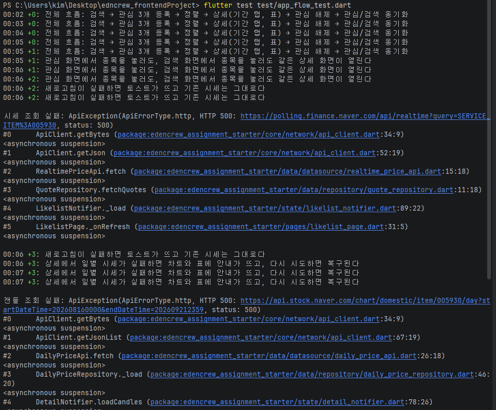

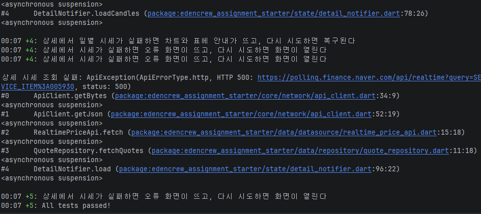

**widget_test.dart**

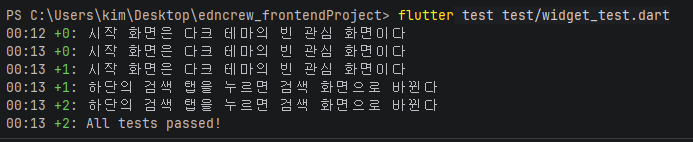

**like_notifier_live_test.dart**

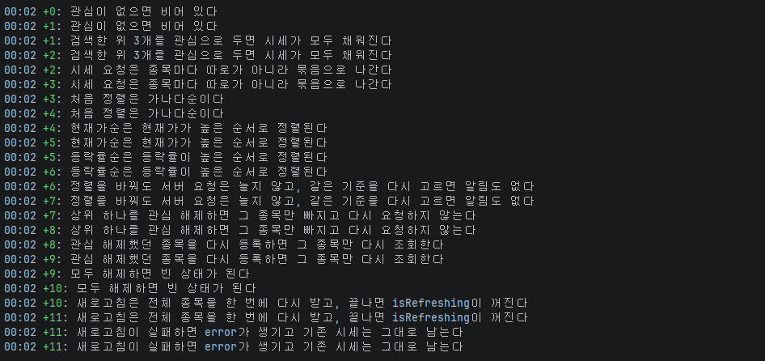

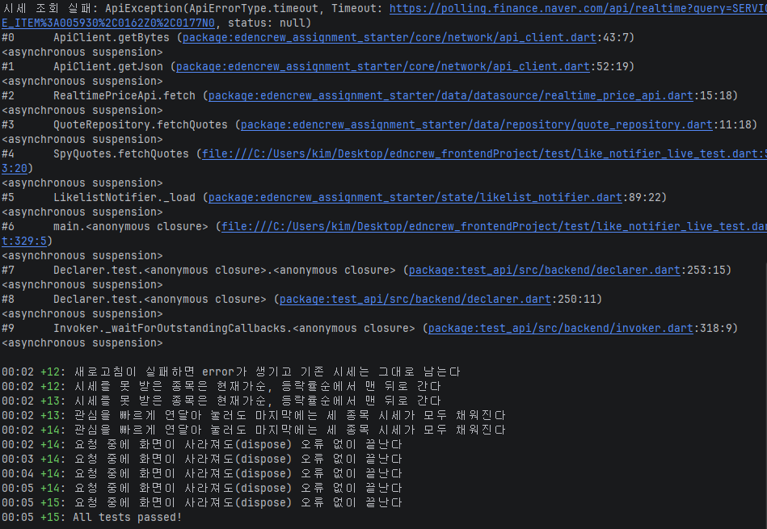

**detail_notifier_live_test.dart**

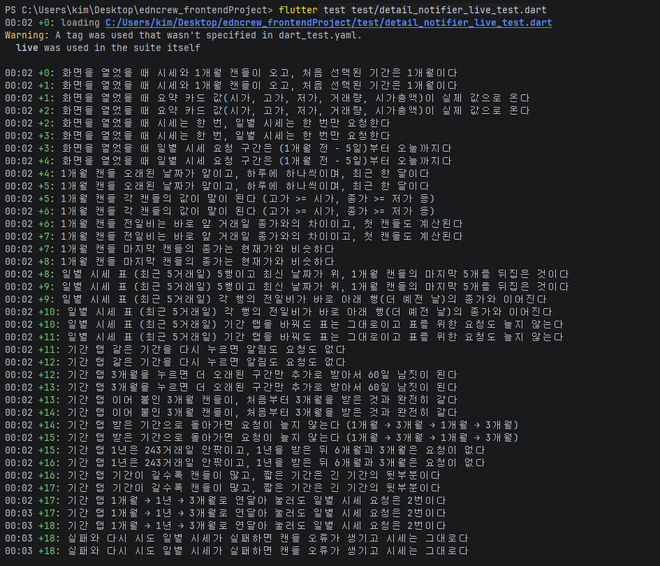

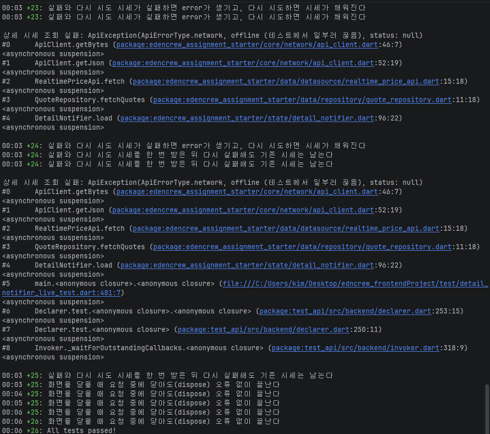

**search_notifier_live_test.dart**

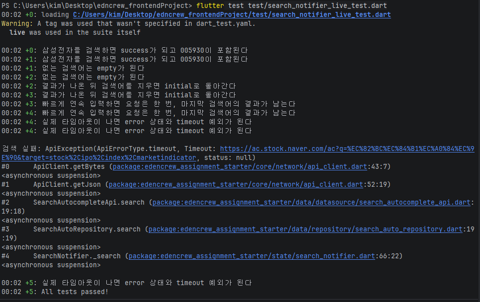

**api_test.dart**

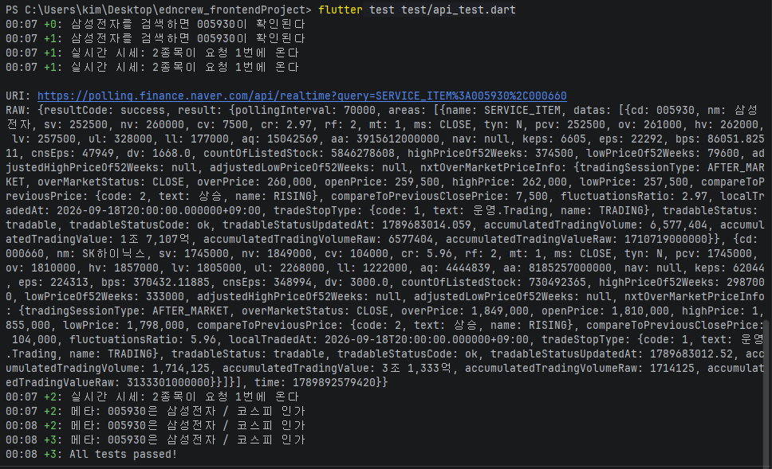

</details>

---

## 3. 기술 선택과 이유

### 상태관리: `provider` + `ChangeNotifier`

- 상태가 화면 단위로 나뉘고 규모가 작습니다. (관심 목록, 검색, 관심 화면, 상세 화면)
- 화면은 그리기만 하고 상태와 통신은 `state/`, `data/`에 둡니다. 그래서 화면 없이도 상태를 테스트할 수 있습니다.
- `Selector`와 `context.select`로 필요한 값이 바뀔 때만 다시 그리도록 했습니다. (정렬 라벨, 종목별 관심 여부)
- 상세 화면의 상태(`DetailNotifier`)는 화면을 열 때 만들고 닫을 때 함께 사라지게 했습니다. 종목마다 상태가 독립적입니다.

### 폴더 구조와 아키텍처

```text
lib/
  components/     Atomic Design: atoms → molecules → organisms
  pages/          관심, 검색, 상세, 하단 탭(main_shell)
  state/          ChangeNotifier들 (관심 목록, 검색, 관심 화면, 상세)
  domain/         앱에서 쓰는 모델 (Stock, Quote, Candle, 정렬/기간 enum)
  data/
    datasource/   endpoint 호출 (검색, 실시간 시세, 일별 시세, 종목 메타)
    dto/          응답 JSON → DTO
    repository/   DTO → domain 모델, 묶음 조회와 캐시
  core/           통신(ApiClient), 예외, 포맷터
  theme/          제공된 디자인 토큰
```

- 화면 조각은 Atomic Design으로 나눴습니다. 종목 제목, 등락 글자, 스켈레톤처럼 여러 화면이 함께 쓰는 것을 재사용하기 위해서입니다.
- 통신은 `ApiClient` 한 곳에서 오류를 `ApiException`(network, timeout, http, parse) 네 가지로 통일합니다. 화면은 이 종류만 보고 문구를 정합니다.

### 주요 패키지

| 패키지 | 용도 |
| --- | --- |
| `provider` | 상태관리 |
| `http` | 통신 |
| `cp949_codec` | 실시간 시세 응답이 EUC-KR이라 디코딩에 사용 |


### 차트: `CustomPainter`로 직접 구현

- 시안의 값(높이 200, 좌우 여백 0.8, 캔들 간격 1.2)과 토큰 색(`chartLineUp`, `chartLineDown`)을 그대로 맞추기 위해서입니다. 패키지는 이런 값을 맞추기 어렵고 의존도 늘어납니다.
- 캔들이 많아 칸이 좁아지면(1년, 약 243개) 간격 1.2가 몸통을 다 먹지 않도록 **간격을 칸 너비의 30%까지만** 쓰게 했습니다. (캔들 20개는 1.2 그대로, 245개는 약 0.44)
- 캔들 색은 종가와 시가를 비교해 정합니다.

### 디자인 토큰

- 색상은 항상 `context.colors`, 간격과 크기는 `context.dimens`로 썼고 hex나 `AppPalette`를 화면에서 직접 쓰지 않았습니다.
- 추가한 토큰: `iconLg = 40` (`AppDimens`). 빈 상태 아이콘이 40px인데 기존 토큰에 없어서 추가했습니다.

---

## 4. 데이터 연동

| 화면 | endpoint |
| --- | --- |
| 검색 | `ac.stock.naver.com/ac` (자동완성) |
| 관심, 상세 | `polling.finance.naver.com/api/realtime` (실시간 시세) |
| 상세 | `api.stock.naver.com/chart/domestic/item/{symbol}/day` (일별 시세, JSON) |
| (화면에서는 사용하지 않음) | `stock.naver.com/api/securityFe/api/fchart/domestic/stock/{symbol}` (종목 메타데이터) |

- **관심종목 시세는 한 번의 요청으로 묶어서** 조회합니다. 새로 등록한 종목만 새로 묻고, 새로고침은 전체를 한 번에 묻습니다.
- 등락은 `현재가 - 전일 종가`, 시가총액은 `현재가 × 상장 주식 수`로 계산합니다.
- 검색 결과는 국내 주식(`KOR`, `stock`)이고 6자리 종목코드인 것만 남깁니다.
- **종목 메타데이터 API**: 요청(`StockMetadataApi`), 파싱과 DTO(`StockMetadataDto`), `Stock` 변환과 종목별 캐시(`StockRepository`)까지 구현하고 `api_test.dart`로 확인했지만, **화면에서는 호출하지 않았습니다.** 검색 결과에 종목명과 시장명(`005930 · 코스피`의 그 값)이 이미 들어 있어서, 검색, 관심, 상세 세 화면이 같은 `Stock` 모델을 재사용하고 같은 값을 다시 요청하지 않도록 했기 때문입니다.

### 일별 시세와 기간 탭 (구간 재사용)

- 날짜 구간으로 조회합니다. 처음에는 **1개월만** 받고, 더 긴 탭(3개월, 6개월, 1년)을 누르면 **이미 받은 구간의 앞쪽(더 오래된 부분)만** 추가로 요청합니다. 받은 구간으로 돌아가면 요청이 없습니다.
- 같은 종목의 요청은 줄을 세웁니다. 1년을 받는 도중에 3개월을 눌러도 겹치는 요청이 나가지 않습니다.
- 전일비는 응답에 없어서 **직전 거래일 종가와의 차이**로 계산합니다. 조회 시작일을 5일 앞당겨 받아 첫 행의 전일비를 구하고, 화면에는 잘라서 보여 줍니다. 앞당긴 구간에도 직전 거래일이 없으면 `-`로 표시합니다.
- 받아 둔 값은 상세 화면 하나에 하나씩 만든 repository가 들고 있어서, 화면을 닫으면 사라집니다. 오늘 행은 장중이면 확정 전 값이라 낡은 값이 남지 않도록 했습니다.

> 처음 받은 문서에는 일별 시세가 HTML endpoint로 적혀 있었는데 HTTP 410이었고, 현재 문서의 JSON endpoint를 기준으로 구현했습니다. 경위는 [6절](#6-막혔던-지점과-접근)에 적었습니다.

### 목 데이터

`assets/mock/`에 일별 시세 실제 응답을 저장했습니다. (삼성전자 1개월, [`assets/mock/README.md`](assets/mock/README.md))

---

## 5. 직접 판단한 부분과 이유

### 토스트

- 2초 동안 보이고 사라집니다. `SnackBar`를 투명하게 만들고 안에 `AppToast`를 넣는 방식이라 하단 탭 위에 뜹니다.
- 관심 등록과 해제는 검색과 상세에서, 새로고침 실패는 관심 화면에서 띄웁니다.
- 새로고침 실패 토스트는 사용자가 직접 새로고침을 눌렀을 때만 띄웁니다. 관심 등록으로 생기는 자동 조회가 실패해도 토스트를 띄우면 다른 탭 위에 나타날 수 있어서입니다.

### API 응답을 기다리는 동안의 화면

시안에는 로딩 상태가 없어서, 응답을 기다리는 동안 화면이 어떻게 보이고 반응할지를 직접 설계했습니다.

| 어디서 | 기다리는 동안 | 응답이 오면 |
| --- | --- | --- |
| 관심 목록 | 시세를 못 받은 행은 이름은 보이고 가격 자리에 **스켈레톤** | 행의 위치가 움직이지 않고 값만 채워짐 (글자 줄 높이를 유지) |
| 관심 목록 (당겨서 새로고침) | 목록을 아래로 당기면 로딩 표시가 나오고 시세를 다시 받음. 종목이 몇 개 안 되어 화면이 차지 않아도 동작 | 기존 값 위에서 갱신 |
| 검색 | 입력 후 300ms 기다렸다가 검색(debounce, 글자마다 요청하지 않음). 결과가 하나도 없을 때만 로딩 표시를 띄우고, **이전 결과가 있으면 그대로 유지** | 늦게 온 이전 검색어의 응답은 버림 |
| 상세: 현재가, 요약 카드 | 현재가와 등락, 카드의 값 자리에 **스켈레톤** | 자리가 그대로라 화면이 흔들리지 않음 |
| 상세: 차트 | 차트와 **같은 높이(200)** 의 로딩 표시 | 아래 요소가 밀리지 않음 |
| 상세: 일별 시세 표 | **스켈레톤 5행** | 실제 행과 같은 높이 |
| 상세: 기간 탭 | 처음 받는 기간만 로딩 표시. **이미 받은 기간은 기다림 없이 바로 표시** | 받는 도중에 다른 탭을 눌러도 요청이 겹치지 않음 |
| 화면을 닫을 때 | 응답이 오기 전에 화면을 닫아도 오류 없이 끝남 | |

### 네트워크 에러

- 검색: 오류 종류(시간 초과, 연결 없음, 서버 오류, 데이터 오류)에 맞는 문구와 "다시 시도".
- 관심: 새로고침에 실패해도 **기존 시세는 그대로** 두고 토스트만 띄웁니다.
- 상세: 시세 실패는 오류 화면, 차트와 표 실패는 각 자리에만 안내와 "다시 시도"를 띄우고 나머지는 정상으로 둡니다. 실패했던 기간 탭을 다시 누르면 자동으로 다시 요청합니다.

### 긴 종목명

종목명과 `종목코드 · 시장` 모두 **한 줄에서 말줄임(`…`)** 으로 처리합니다. 검색 결과, 관심 목록, 상세 헤더가 같은 컴포넌트(`StockTitleBlock`)를 쓰므로 세 화면이 같게 동작합니다.

### 시세를 못 받은 행의 정렬

현재가순과 등락률순에서는 **맨 뒤**로 보냅니다. 값을 비교할 수 없는 행이 위에 끼어 정렬이 어색해 보이는 것을 막기 위해서입니다. 값이 같으면 이름순, 그다음 종목코드순입니다. 가나다순은 문자 코드 순서라 영문 이름(KODEX, RISE 등)이 한글보다 앞에 옵니다.

### 일별 시세 표: 기간 탭과 관계없이 최근 5거래일

- 과제 문서는 "탭을 바꾸면 차트와 일별 시세 표의 기간이 바뀐다"고 하지만, 이 앱의 표는 **탭과 무관하게 최근 5거래일**만 보여 줍니다. Figma 화면을 본 따 5개로 정했습니다.
- 표를 위해 별도 요청을 하지 않고, 처음 화면을 열 때 받은 1개월 캔들의 마지막 5개를 씁니다. 일수는 상수(`DetailNotifier.tableDays`) 하나라 바꾸기 쉽습니다.
- 등락은 부호를 붙여(`+500`, `-1,500`), 플러스는 `priceUpText`, 마이너스는 `priceDownText`, 0과 모름은 `textSecondary`로 표시합니다. 상세 화면 상단의 등락은 시안대로 금액에 부호를 붙이지 않고 등락률에만 붙입니다.
- 로딩(스켈레톤 5행), 빈 상태, 실패(다시 시도)는 시안에 없어서 직접 정했습니다.

### Figma와 다르게 구현했거나 시안 값이 없어 정한 부분

- **차트**: 캔들 몸통 두께와 세로 범위는 남는 폭과 최저, 최고가로 계산했습니다. 시안 값이 없어 정한 부분이고, 과제 문서가 "차트 안쪽의 그림은 시안과 달라도 감점하지 않는다"고 안내한 범위입니다. 캔들이 많을 때 간격을 줄이는 규칙은 3절 "차트"에 적었습니다.

---

## 6. 막혔던 지점과 접근

- **일별 시세 endpoint가 410으로 사라져 있었습니다.**
  - 처음 받은 `docs/NAVER_API.md`에는 일별 시세가 "**HTML을 반환하는 API**"(`finance.naver.com/item/sise_day.naver`)로 적혀 있었습니다. EUC-KR 디코딩, 표 파싱, 페이지당 10거래일을 이어서 받고 `lastPage`를 넘지 않게 하는 요구까지 있어서, 그에 맞춰 HTML 파서와 페이지 이어받기를 만들 계획이었습니다.
  - 그런데 실제로 호출해 보니 **HTTP 410**("이 페이지는 더 이상 제공되지 않습니다")이 돌아오고 표 머리글만 남은 빈 페이지였습니다. 파싱할 시세 행이 없어서 `assets/mock/`에 저장할 응답도, 파서를 검증할 샘플도 만들 수 없었습니다.
  - 다른 경로를 찾다가 Postman으로 `api.stock.naver.com/chart/domestic/item/{symbol}/day`를 호출하니 **정상 응답(200)** 이 오는 것을 확인했습니다. 이어서 원본 저장소의 `docs/NAVER_API.md`를 확인해 보니 문서가 이미 이 **날짜 구간 JSON endpoint로 바뀌어** 있었습니다. (제가 받은 문서가 옛 버전이었습니다.) 이 시점에 문서를 원본으로 갱신하고 구현 기준을 바꿨습니다.
  - 바뀐 방식에 맞춰 "페이지 이어받기"를 **"날짜 구간 재사용"** 으로 다시 설계했습니다. 처음에는 1개월만 받고, 더 긴 탭에서는 더 오래된 구간만 추가로 받는 repository입니다. (4절 참고)
  - 이 과정에서 HTML 파서용으로 잠깐 만들었던 샘플과 코드는 모두 지웠고, `html` 패키지도 쓰지 않습니다.
- **개발 환경**: 에뮬레이터 가상화, JDK 버전(21), NDK 설치 문제를 순서대로 해결했습니다.
